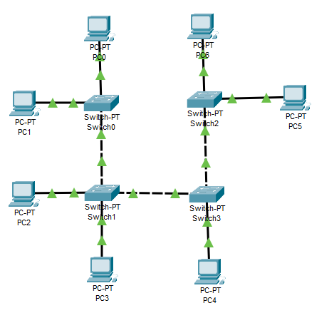
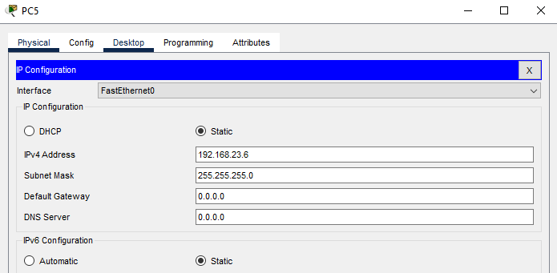
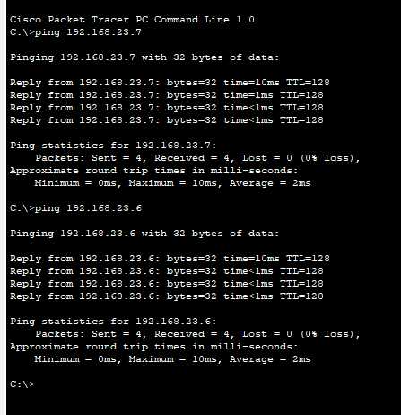
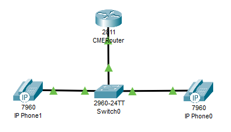
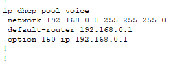
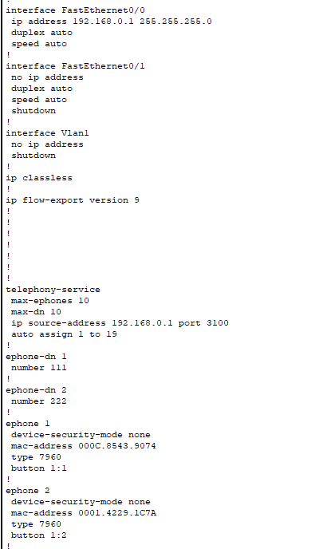
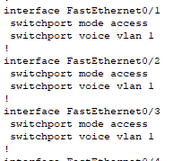

University: [ITMO University](https://itmo.ru/ru/) \
Faculty: [FICT](https://fict.itmo.ru) \
Course: [IP-telephony](https://github.com/itmo-ict-faculty/ip-telephony) \
Year: 2023/2024 \
Group: K4202 \
Author: Shabashov Vasiliy Andreevich \
Lab: Lab1 \
Date of create: 15.02.2024

# Лабораторная работа №1 "Базовая настройка ip-телефонов в среде Сisco packet tracer"

## Описание
Для выполнения данной лабораторной работы собирается схема соединения. Необходимо проверить, правильно ли подключены и настроены все узлы устройств.

## Цель работы
Изучить рабочую среду Cisco Packet Tracer, ознакомиться с интерфейсами основных устройств, типами кабелей, научиться собирать топологию. Изучить построение сети IP-телефонии с помощью маршрутизатора, коммутатора и IP телефонов Cisco 7960 в среде Packet tracer.

## Часть 1
1. Собрали схему соединения.

2. Задали статические адреса устройствам.

3. После выполнения необходимых настроек убедились в том, что любой компьютер одной сети посредством пинга передает пакеты любому компьютеру другой сети.

## Часть 2
1. Собрали схему соединения.

2. Изменили имя маршрутизатора на CMERouter.
3. Настроли интерфейс fa0/0 на маршрутизаторе.
4. Настроили DHCP сервера для передачи голоса и данных на маршрутизаторе.
5. Настроили услуги телефонии на маршрутизаторе.
6. Настроили маршрутизацию сети.
7. Создали VLAN порты на коммутаторе для взаимодействия коммутатора с маршрутизатором и подключили IP телефоны.
8. Настроили IP-телефоны, присвоили им номера и соединили с коммутатором.

Настройки маршрутизатора: \
 \

Настройки коммутатора: \

Проверили звонки между телефонами.

## Вывод
Была изучиена рабочая среда Cisco Packet Tracer, ознакомились с интерфейсами основных устройств, типами кабелей, научились собирать топологию. Было изучено построение сети IP-телефонии с помощью маршрутизатора, коммутатора и IP телефонов Cisco 7960 в среде Packet Tracer.