University: [ITMO University](https://itmo.ru/ru/) \
Faculty: [FICT](https://fict.itmo.ru) \
Course: [IP-telephony](https://github.com/itmo-ict-faculty/ip-telephony) \
Year: 2023/2024 \
Group: K4202 \
Author: Shabashov Vasiliy Andreevich \
Lab: Lab2 \
Date of create: 17.02.2024

# Лабораторная работа №2 "Конфигурация voip в среде Сisco packet tracer"

## Описание
Для выполнения данной лабораторной работы собирается схема соединения. Необходимо проверить, правильно ли подключены все узлы устройств. Предварительно удалить все преды- дущие конфигурационные файлы на маршрутизаторах Cisco 2811, на коммутаторе Cisco catalyst 3560.

## Цель работы
Изучить построение сети IP-телефонии с помощью маршрутизатора Cisco 2811, коммутатора Cisco 

## Часть 1

1. Создали топологию сети.

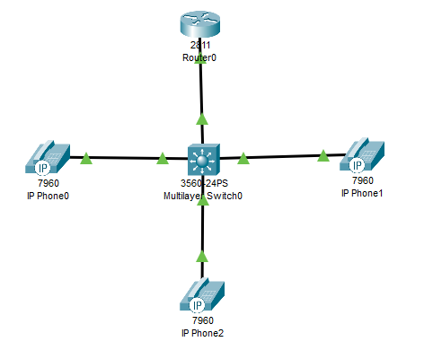

2. В конфигурационном режиме изменили название маршрутизатора на CMERouter.
3. Отключили синтаксис ввода слов от DNS серверов.
4. Задали пароли для защиты маршрутизатора как в удаленном режиме, так и в режиме консоли.
5. Настроили интерфейс fa0/0.
6. Настроили DHCP сервера для передачи голоса и данных.
7. Настроили услуги телефонии.

Настройки маршрутизатора: \
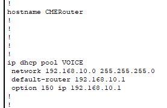 \
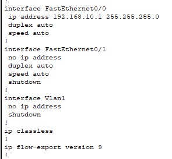 \
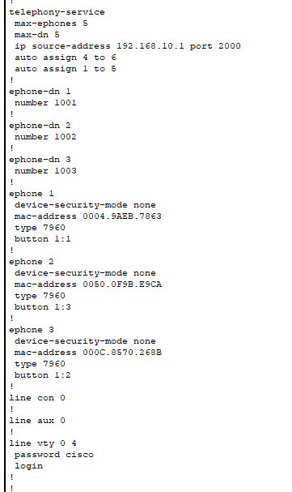

8. Создали VLAN порты на коммутаторе для взаимодействия коммутатора с маршрутизатором и подключили IP телефоны.
9. Настроили IP-телефоны и соединили с коммутатором.

Настройки коммутатора: \
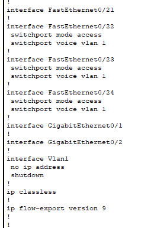

Проверили звонки между телефонами.

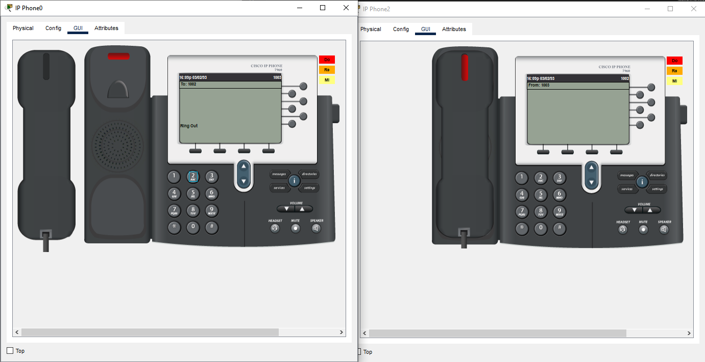 \
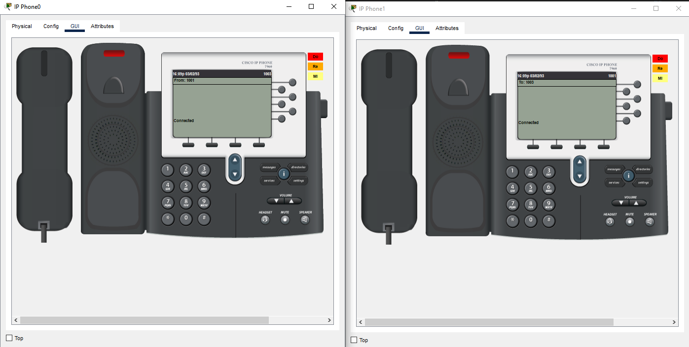

## Часть 2
1. Создали топологию сети.

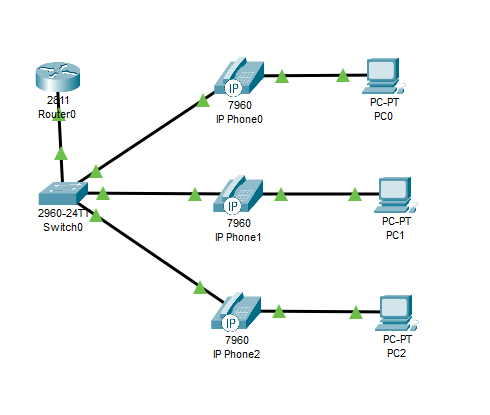

2. Создали VLAN порты на коммутаторе для взаимодействия коммутатора с маршрутизатором и подключили IP телефоны.
3. Задали маршрут по умолчанию командой ip default-gateway.
4. Настроили порт как канал типа trunk.
5. Настроили DHCP сервера для передачи голоса и данных на маршрутизаторе.
6. Настроили услуги телефонии на маршрутизаторе.
7. Настроили IP-телефоны и соединить с коммутатором.
8. Подключили конечные узлы устройств.

Настройки маршрутизатора: \
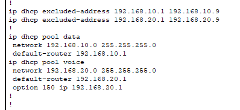 \
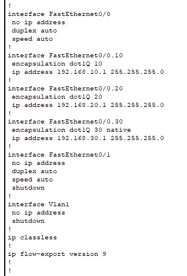 \
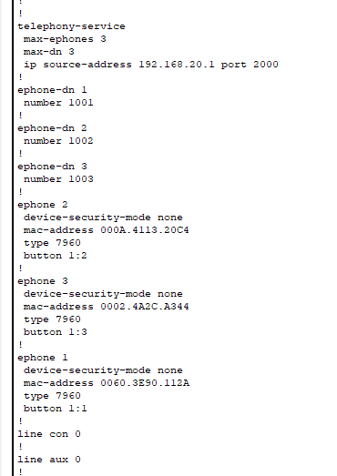

Настройки коммутатора: \
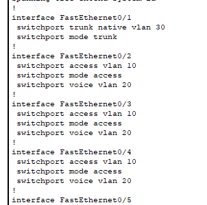 \
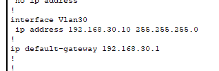

Проверили звонки между телефонами и связанность между компьютерами.

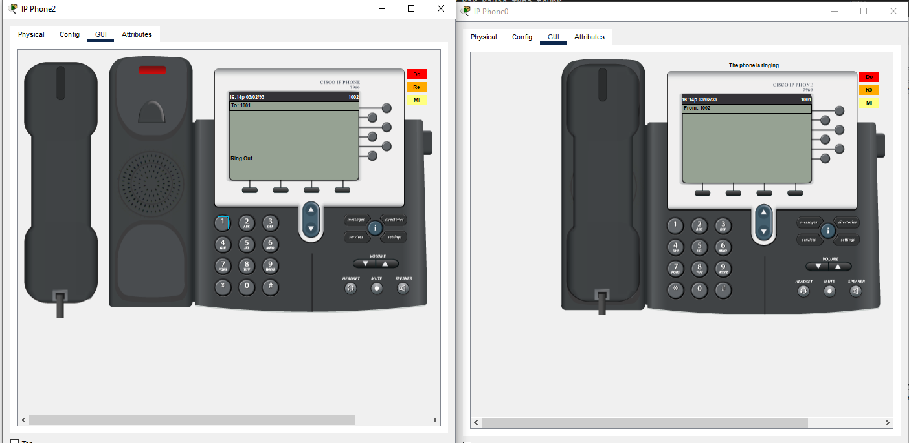 \
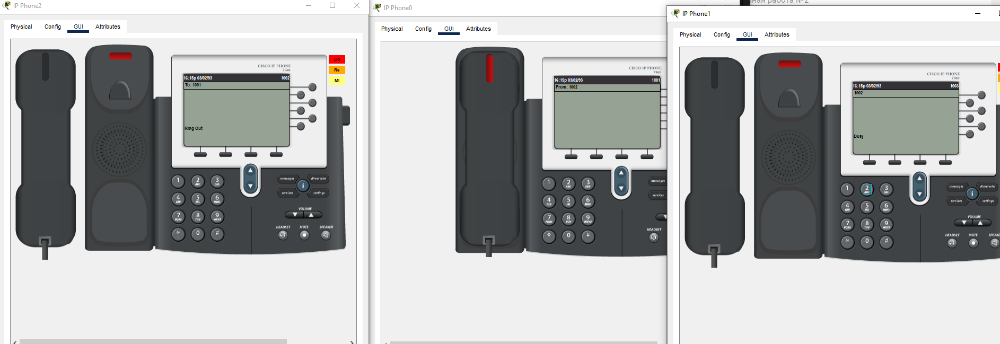

## Вывод
Было изучено построение сети IP-телефонии с помощью маршрутизатора Cisco 2811, коммутатора Cisco catalyst 3560 и IP телефонов Cisco 7960.