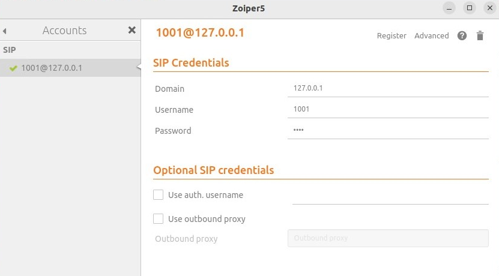

University: [ITMO University](https://itmo.ru/ru/) \
Faculty: [FICT](https://fict.itmo.ru) \
Course: [IP-telephony](https://github.com/itmo-ict-faculty/ip-telephony) \
Year: 2023/2024 \
Group: K4202 \
Author: Shabashov Vasiliy Andreevich \
Lab: Lab3 \
Date of create: 29.02.2024

# Лабораторная работа №3 " Использование Asterisk в качестве SIP proxy"

## Описание
Для выполнения данной лабораторной работы необходимо выполнить настройку Asterisk.

## Цель работы
Изучить программный комплекс Asterisk. Настройка Asterisk для локальных звонков.

## Ход работы
1. Установили Asterisk с помощью команды ```sudo apt install asterisk```
2. Прописали необходимые настройки.

В файле extensions.conf:
```
[ext_1000]
exten => _XXXX,1,Dial(SIP/${EXTEN})

[ext_1001]
exten => _XXXX,1,Dial(SIP/${EXTEN})
```
В файле sip.conf:
```
[1000]
type=friend
host=dynamic
secret=123
context=ext_1000

[1001]
type=friend
host=dynamic
secret=123
context=ext_1001
```
Для того чтобы прописанные изменения в файлах конфигурации вступили в силу, осуществили перезапуск Asterisk командой ```sudo service asterisk restart```. Затем проерили статус с помощью команды ```sudo service asterisk status```

3. Установили soft телефоны Zoiper5 и MicroSIP.

Настроили Zoiper5: \


Настроили MicroSIP: \


4. Сделали тестовый звонок: \


## Вывод
Мы изучили программный комплекс Asterisk и сделали настройку Asterisk для локальных звонков.